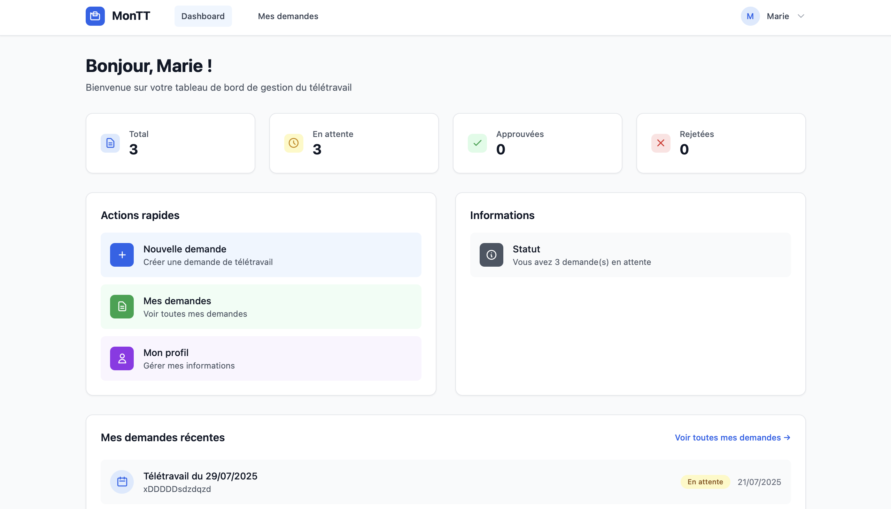
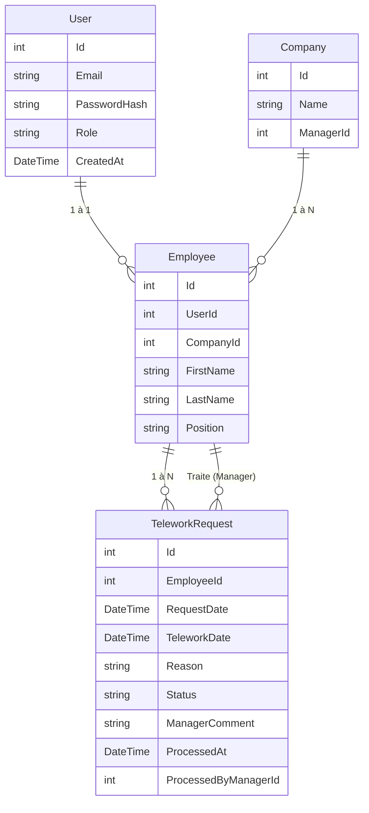
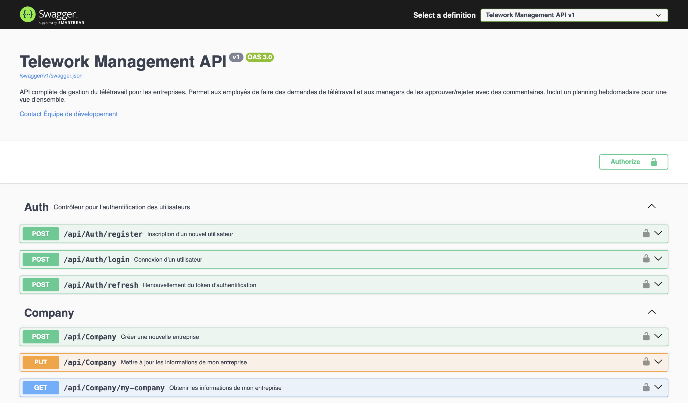

# MonTT

## Présentation du projet

**MonTT** est une application web minimaliste de gestion du télétravail. Elle permet aux employés de soumettre des demandes de télétravail, et aux managers de les approuver ou refuser, de planifier la semaine et de gérer les employés de leur entreprise. L'application propose une API RESTful en ASP.NET Core (backend) et une interface moderne en SvelteKit (frontend).

### Fonctionnalité phare : planning unifié pour le manager

Les managers disposent d'un planning de visualisation hebdomadaire qui leur permet de voir, en un coup d'œil, l'ensemble des demandes de télétravail de tous les employés de leur entreprise. Ce planning unifié facilite la gestion, l'organisation et l'équilibre des équipes, en offrant une vue centralisée de la répartition du télétravail sur la semaine.

## Démarrage du projet

### 1. Backend (ASP.NET Core)

```bash
cd Backend
# Assurez-vous d'avoir le SDK .NET 8 installé
# Installez les dépendances si besoin
# Démarrez l'API sur http://localhost:5000

dotnet run --urls "http://localhost:5000"
```

- L'API est documentée via Swagger sur [http://localhost:5000](http://localhost:5000)
- La base SQLite est générée automatiquement (`app.db`)

### 2. Frontend (SvelteKit)

```bash
cd Frontend
# Installez les dépendances
npm install
# Lancez le serveur de développement
npm run dev
```

- L'application sera accessible sur [http://localhost:5173](http://localhost:5173)

#### Aperçu de l'interface utilisateur



## Identifiants de connexion pour tester

**Manager**
- Email : `manager@test.com`
- Mot de passe : `password123`

**Employé**
- Email : `employee1@test.com`
- Mot de passe : `password123`

D'autres comptes de test sont générés automatiquement (voir la seed de la base).

## Diagramme des modèles



---

**Swagger** est disponible pour explorer et tester l'API.

 